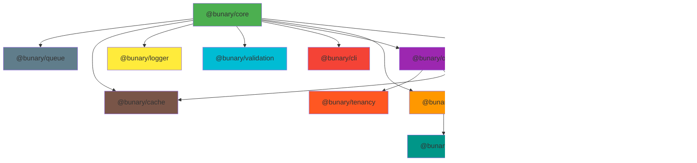

# Bunary Framework Roadmap (3, 6, 12 Months)

This roadmap is a living document. Priorities, timelines, and features will shift as we learn from real-world use and community feedback. If you have ideas, requests, or concerns about what's here, open an issue or start a discussion—your input shapes where Bunary goes next.

## Observations

Bunary has completed its MVP with five core packages—@bunary/core, @bunary/http, @bunary/auth, @bunary/cli, and @bunary/orm—giving a solid foundation for Bun-first backend development. The ORM already includes SQLite support with migrations, schema builder, and transactions. The framework follows Laravel-inspired patterns while staying Bun-native for performance.

Current gaps include validation, caching, background jobs, advanced authentication, and more database drivers. Closing these is important for production-grade applications.

## Approach

The roadmap orders work by developer pain, production readiness, and ecosystem maturity:

- **3 months:** Essential production features (validation, logging, security middleware).
- **6 months:** Scalability and performance (caching, queues, MySQL/PostgreSQL).
- **12 months:** Advanced capabilities (OAuth, multi-tenancy, WebSockets, testing utilities).

**Package independence.** Packages should minimize dependencies on other Bunary packages. Exceptions—such as http (needs core), auth (needs http and core), and orm (needs core)—are justified where the coupling is essential. Integrations (e.g. http + validation, http + logger) should be optional or adapter-based where possible so that packages remain usable in isolation.

Each phase is designed to deliver clear value and move toward a framework that matches Laravel’s developer experience in the Bun ecosystem.

## 3-Month Roadmap: Production Essentials

This phase focuses on validation, security, logging, and documentation so apps can run safely in production.

### Month 1: Validation & Security Foundations

#### 1.1 Validation Package (@bunary/validation)

Create a new validation package with a Laravel-inspired fluent API for request validation.

**Key features**

- Fluent validation rules: `required()`, `string()`, `email()`, `min()`, `max()`, `numeric()`, `boolean()`, `array()`, `object()`
- Custom rules via `Rule.custom((value) => boolean)`
- Nested object and array validation
- Type-safe validation with TypeScript inference
- Optional integration with @bunary/http via `ctx.validate(schema)` (e.g. when used as middleware)
- Automatic 422 error response formatting
- Custom error messages and localization support

**Implementation steps**

- Define `ValidationSchema` and `ValidationRule` types in `packages/validation/src/types.ts`
- Implement core validators in `packages/validation/src/validators.ts`
- Create fluent schema builder in `packages/validation/src/schema.ts`
- Add HTTP integration middleware in `packages/validation/src/middleware.ts`
- Add tests and document in `packages/validation/README.md`

#### 1.2 Security Middleware Package (@bunary/security)

Provide essential security middleware for production applications.

**Key features**

- CORS middleware with configurable origins, methods, and headers
- CSRF protection with token generation and validation
- Rate limiting with in-memory store (Redis support in Phase 2)
- Helmet-style security headers (X-Frame-Options, X-Content-Type-Options, etc.)
- Request sanitization (XSS prevention)

**Implementation steps**

- Create CORS middleware in `packages/security/src/cors.ts`
- Implement CSRF in `packages/security/src/csrf.ts`
- Build rate limiter in `packages/security/src/rateLimit.ts`
- Add security headers in `packages/security/src/headers.ts`
- Integrate with @bunary/http app options and document best practices

#### 1.3 CLI Enhancements

Extend the CLI with validation and security scaffolding.

**New commands**

- `bunary validation:make <name>` — Generate a validation schema
- `bunary middleware:make <name> --type=cors|csrf|rate-limit` — Generate security middleware with presets
### Month 2: Logging & Observability

#### 2.1 Logging Package (@bunary/logger)

Structured logging with multiple transports and log levels.

**Key features**

- Log levels: debug, info, warn, error, fatal
- Transports: console, file, HTTP endpoint
- Structured context (request ID, user ID, metadata)
- Formatting: JSON and pretty-print for development
- Optional integration with @bunary/http for request/response logging
- Performance-optimized (async writes, batching)

**Implementation steps**

- Define `Logger` and `LogLevel` types in `packages/logger/src/types.ts`
- Implement core logger in `packages/logger/src/logger.ts`
- Add transports in `packages/logger/src/transports/`
- Add HTTP middleware for request/response logging
- Expose app-scoped logger via `createLogger(config)` and document usage

#### 2.2 Error Handling Improvements

Improve error handling in @bunary/http for better developer experience.

**Key features**

- Custom error classes: `ValidationError`, `AuthenticationError`, `NotFoundError`, `ForbiddenError`
- Error serialization with stack traces (dev only)
- Optional integration with @bunary/logger for error logging
- Configurable error responses (JSON API vs HTML)

**Implementation steps**

- Add error classes in `packages/http/src/errors/`
- Update `onError` handler to use logger
- Add error serialization helpers and document patterns
### Month 3: File Uploads & Documentation

#### 3.1 File Upload Support

Native file upload handling using Bun’s `Bun.file()` API.

**Key features**

- Multipart form-data parsing
- File validation (size, MIME type, extensions)
- Storage drivers: local filesystem, S3-compatible (via Bun’s native fetch)
- Automatic file naming (UUID, timestamp)
- Optional use of @bunary/validation for file rules
- Streaming uploads for large files

**Implementation steps**

- Add multipart parser in `packages/http/src/multipart.ts`
- Add upload utilities in `packages/http/src/upload.ts`
- Implement storage drivers in `packages/http/src/storage/`
- Add file validation rules in @bunary/validation and document patterns

#### 3.2 Documentation Expansion

Expand documentation with guides and API reference.

**Content to add**

- Validation guide with real-world examples
- Security best practices guide
- Logging and error handling guide
- File upload tutorial
- Production deployment guide (Docker, systemd, PM2)
- Performance optimization guide
- Migration guide from Express/Fastify

**Implementation steps**

- Add guides under `documentation/guides/advanced/`
- Update package documentation in each package repo
- Add code examples to the documentation site
- Build an interactive API playground on the site (see 3.3)

#### 3.3 OpenAPI / API docs (spec-from-routes)

Generate OpenAPI 3.x from registered Bunary routes and serve an interactive “try it out” UI for manual API testing (Swagger UI or similar).

**Key features**

- **Spec-from-routes:** Build OpenAPI document from the app’s route table (method, path, path params). No decorators or magic; use explicit route metadata or a small docs API (e.g. `app.get("/users/:id", handler).description("Get user by ID")` or a separate openApi config that references routes).
- **Optional per-route metadata:** Description, tags, request/response schema (optional integration with @bunary/validation for schema inference).
- **Served spec and UI:** Expose `/openapi.json` (or `.yaml`) and a docs route that serves Swagger UI (or Redoc/Scalar) so developers can manually test endpoints in the browser.
- **Package independence:** Implement as part of @bunary/http (route introspection + spec generation) or a thin @bunary/openapi package that depends only on http; UI can be static assets or a small middleware.

**Implementation steps**

- Add spec generation in @bunary/http: walk registered routes, output OpenAPI 3.x (paths, methods, path params; optional descriptions/schemas from route metadata or config).
- Add optional API for per-route docs (description, tags, request/response schema) without decorators.
- Serve generated spec at a configurable path (e.g. `/openapi.json`) and serve Swagger UI (or similar) at a docs path (e.g. `/docs`) for manual testing.
- Optional: integrate with @bunary/validation to include request/response schemas in the spec when validation schemas are attached to routes.
- Document in guides and link from Documentation Expansion (3.2).

## 6-Month Roadmap: Scalability & Performance

This phase adds caching, queues, events, and MySQL/PostgreSQL so apps can scale.

### Month 4: Caching Layer

#### 4.1 Cache Package (@bunary/cache)

Multi-driver caching for performance optimization.

**Key features**

- Drivers: in-memory, Redis, file-based
- Operations: `get()`, `set()`, `has()`, `delete()`, `flush()`, `remember()`
- TTL with automatic expiration
- Cache tags for grouped invalidation
- ORM integration for query result caching
- Cache-aside pattern helpers

**Implementation steps**

- Define `CacheDriver` in `packages/cache/src/types.ts`
- Implement drivers in `packages/cache/src/drivers/` (memory, redis)
- Add cache manager in `packages/cache/src/manager.ts`
- Add ORM integration and document caching strategies

#### 4.2 HTTP Response Caching

Built-in HTTP response caching middleware.

**Key features**

- Route-level cache configuration
- Cache key from request (URL, query, headers)
- Conditional caching by response status
- Cache invalidation hooks
- ETag and Last-Modified support
### Month 5: Background Jobs & Queues

#### 5.1 Queue Package (@bunary/queue)

Background job processing with multiple queue backends.

**Key features**

- Drivers: in-memory, Redis, database-backed
- Type-safe job payloads
- Scheduling (delayed jobs, cron-like)
- Retries with exponential backoff
- Job prioritization and worker process management
- Monitoring and failure handling

**Implementation steps**

- Define `Job` and `Queue` in `packages/queue/src/types.ts`
- Implement queue manager in `packages/queue/src/manager.ts`
- Add drivers in `packages/queue/src/drivers/`
- Build worker in `packages/queue/src/worker.ts`
- Add CLI: `bunary queue:work`, `bunary queue:listen`, `bunary job:make`; document patterns

#### 5.2 Event System

Simple event dispatcher for decoupled architecture.

**Key features**

- Event registration and dispatching
- Sync and async listeners
- Event prioritization
- Integration with queue for async handling
### Month 6: Database Expansion

#### 6.1 MySQL Driver (@bunary/orm)

Complete MySQL support in the ORM package.

**Key features**

- Connection pooling
- Full query builder support
- Schema builder for MySQL-specific features
- Migrations and transactions
- Connection config via @bunary/core

**Implementation steps**

- Implement `MysqlDriver` in `packages/orm/src/drivers/mysql-driver.ts`
- Add MySQL-specific schema builder features
- Update connection manager and config types
- Test against MySQL 8.0+ and document setup

#### 6.2 PostgreSQL Driver (@bunary/orm)

PostgreSQL support with advanced features.

**Key features**

- Connection pooling
- Full query builder support
- PostgreSQL types (JSONB, arrays, etc.)
- Schema builder with PostgreSQL features
- Migrations and transactions (including savepoints)

**Implementation steps**

- Implement `PostgresDriver` in `packages/orm/src/drivers/postgres-driver.ts`
- Add PostgreSQL-specific schema builder
- Support JSONB, arrays, full-text search
- Update connection manager; test against PostgreSQL 14+; document setup
## 12-Month Roadmap: Advanced Features

This phase adds OAuth, MFA, WebSockets, testing utilities, multi-tenancy, and performance tooling.

### Month 7-8: Advanced Authentication

#### 7.1 OAuth Package (@bunary/oauth)

OAuth 2.0 provider and client support.

**Key features**

- Server: authorization code, client credentials, refresh tokens
- Client for third-party providers (Google, GitHub, Microsoft, etc.)
- PKCE for mobile/SPA clients
- Token management and refresh; scope-based authorization
- Optional integration with @bunary/auth

**Implementation steps**

- Add OAuth server in `packages/oauth/src/server.ts` and client in `packages/oauth/src/client.ts`
- Add provider configs (Google, GitHub, etc.) and OAuth guards for @bunary/auth
- Add CLI: `bunary oauth:provider <name>`; document OAuth flows

#### 7.2 Multi-Factor Authentication (MFA)

Built-in MFA support for enhanced security.

**Key features**

- TOTP (time-based one-time password)
- SMS-based OTP (via plugin system)
- Backup codes; enrollment and verification flows; recovery

**Implementation steps**

- Add MFA utilities to @bunary/auth; implement TOTP generator/validator
- Add MFA middleware and database schema for secrets; document implementation
### Month 9-10: Real-Time & Testing

#### 9.1 WebSocket Support (@bunary/websocket)

Real-time communication using Bun’s native WebSocket server.

**Key features**

- Optional integration with @bunary/http
- Room/channel management and broadcasting
- Authentication for WebSocket connections (with @bunary/auth)
- Presence tracking

**Implementation steps**

- Add WebSocket server in `packages/websocket/src/server.ts` and room management in `packages/websocket/src/rooms.ts`
- Add broadcasting utilities; integrate with HTTP app; document patterns

#### 9.2 Testing Utilities (@bunary/testing)

First-class testing support for Bunary applications.

**Key features**

- HTTP test client with fluent assertions
- Database factories and seeders
- Mock auth helpers; SQLite in-memory test DB
- Integration with `bun test`; request/response assertions

**Implementation steps**

- Add test client in `packages/testing/src/client.ts` and factories in `packages/testing/src/factories.ts`
- Add auth mocking and assertion helpers; document best practices
### Month 11-12: Multi-Tenancy & Performance

#### 11.1 Multi-Tenancy Package (@bunary/tenancy)

Enterprise-grade multi-tenancy support.

**Key features**

- Tenant identification: subdomain, path, header, database
- Tenant-scoped DB connections and ORM queries
- Tenant middleware for automatic scoping
- Tenant migration management and tenant-specific config

**Implementation steps**

- Add tenant manager in `packages/tenancy/src/manager.ts` and strategies in `packages/tenancy/src/strategies/`
- Add ORM integration and tenant middleware
- Add CLI: `bunary tenant:create`, `bunary tenant:migrate`; document patterns

#### 11.2 Performance Optimization

Framework-wide performance improvements.

**Key features**

- Route caching for production (static route map)
- Lazy loading; connection pooling; query optimization
- Performance monitoring middleware; benchmarking suite

**Implementation steps**

- Add route caching in @bunary/http and monitoring in @bunary/logger
- Add benchmarking tools; optimize ORM query generation; document practices

#### 11.3 API Versioning

Built-in API versioning support.

**Key features**

- Version-based routing (e.g. `/v1/users`, `/v2/users`)
- Header-based versioning (`Accept: application/vnd.api+json; version=1`)
- Deprecation warnings and version migration helpers
## Visual Roadmap

Timeline view of when each major deliverable is planned (approximate; dates may shift).

## Package Dependency Map

How planned packages depend on each other (core at the center; future packages in gray areas).

## Success Metrics

Targets used to judge whether each phase is on track.

### 3-Month Milestone

- ✅ Validation package published with 90%+ test coverage
- ✅ Security middleware adopted in 50%+ of example projects
- ✅ Logging integrated into all core packages
- ✅ File upload examples in documentation
- ✅ 10+ comprehensive guides published

### 6-Month Milestone

- ✅ Cache package reduces API response time by 40%+
- ✅ Queue package handles 1000+ jobs/second
- ✅ MySQL and PostgreSQL drivers pass full test suite
- ✅ 3+ production applications using Bunary
- ✅ Community contributions to 2+ packages

### 12-Month Milestone

- ✅ OAuth package supports 5+ providers
- ✅ WebSocket package handles 10,000+ concurrent connections
- ✅ Multi-tenancy package used in 2+ SaaS applications
- ✅ Framework benchmarks competitive with Fastify/Hono
- ✅ 100+ GitHub stars, 20+ contributors

## Implementation Priorities

Priorities for planning and resourcing (not a strict sequence).

### High Priority (Must-Have)

- Validation package - Critical for production apps
- Security middleware - Essential for security
- Logging package - Required for debugging
- Cache package - Performance optimization
- Queue package - Background processing

### Medium Priority (Should-Have)

- MySQL/PostgreSQL drivers - Database flexibility
- OAuth package - Modern auth requirement
- WebSocket support - Real-time features
- Testing utilities - Developer experience
- File uploads - Common use case

### Low Priority (Nice-to-Have)

- Multi-tenancy - Enterprise feature
- API versioning - Advanced use case
- Performance optimization - Continuous improvement
- MFA support - Security enhancement

## Community Engagement

Ways to grow adoption and contributions beyond code.

### Documentation

- Publish monthly blog posts on new features
- Create video tutorials for major packages
- Maintain changelog with migration guides
- Host community Q&A sessions

### Open Source

- Accept community contributions for all packages
- Maintain issue templates and contribution guidelines
- Provide starter kits for common use cases
- Create plugin ecosystem for third-party integrations

### Ecosystem

- Partner with Bun team for official recognition
- Integrate with popular tools (Prisma, Drizzle, etc.)
- Create VS Code extension for better DX
- Build community Discord/Slack channel

---

